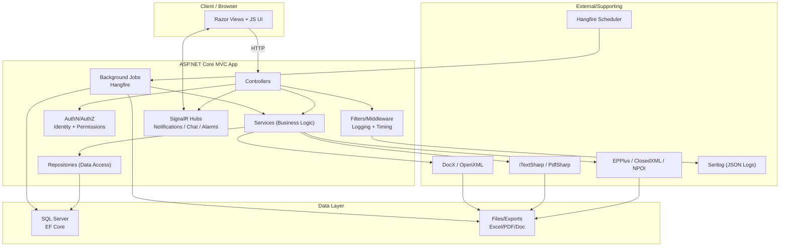

# Architecture Overview

Last updated: January 29, 2026

## Purpose
This document describes the high-level architecture for the Conscript Affairs Management System.
It avoids any internal deployment details or sensitive configuration.

## High-Level Layers
- Presentation: ASP.NET Core MVC and Razor Views
- Business Logic: Services and DTOs
- Data Access: Repositories and EF Core (SQL Server)
- Security: ASP.NET Identity and permission policies
- Background: Hangfire jobs
- Real-time: SignalR hubs (notifications, chat, alarms)

## Key Components
- Controllers: module endpoints (Soldiers, Officers, Departments, States, Alarms, etc.)
- Services: domain workflows (state transitions, imports, exports, backups)
- Repositories: persistence and query layer
- Filters and Middleware: logging, timing, authorization

## Data Flow (Typical)
User -> MVC Controller -> Service -> Repository -> EF Core -> SQL Server

## Integration Points
- Excel import and export for bulk operations
- PDF and document generation for reports
- SignalR for real-time events

## Diagrams
- [Architecture Diagram (SVG)](../assets/architecture.svg)

## Advanced Architecture Diagram (Mermaid)
Copy this into GitHub (it renders automatically):

