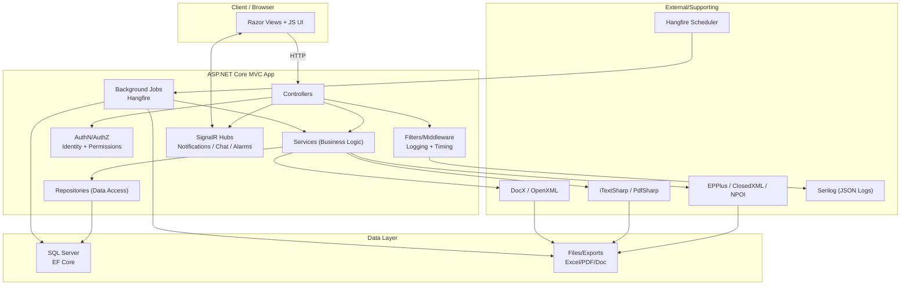

# Architecture Overview

## High-Level Layers
- Presentation: ASP.NET Core MVC + Razor Views
- Business Logic: Services + DTOs
- Data Access: Repositories + EF Core (SQL Server)
- Security: ASP.NET Identity + custom permission policies
- Background: Hangfire jobs
- Real-time: SignalR hubs (notifications, chat, alarms)

## Key Components
- Controllers: module endpoints (Soldiers, Officers, Departments, States, Alarms, etc.)
- Services: domain workflows (state transitions, imports/exports, backups)
- Repositories: data persistence and queries
- Filters/Middleware: logging, timing, authorization

## Data Flow (Typical)
User -> MVC Controller -> Service -> Repository -> EF Core -> SQL Server

## Integration Points
- Excel import/export for bulk operations
- PDF/Doc generation for reports
- SignalR for real-time events

## Suggested Diagram (Add to assets/)
1) User/UI
2) MVC Controllers
3) Services
4) Repositories
5) Database
6) Hangfire/SignalR

## Advanced Architecture Diagram (Mermaid)
Copy this into GitHub (it renders automatically):

